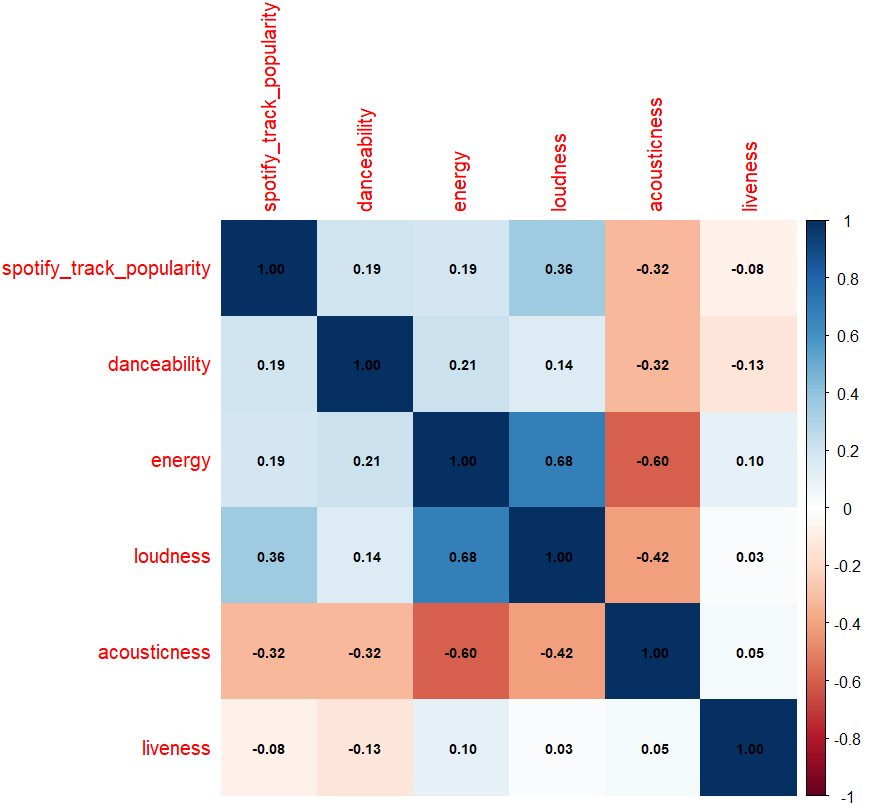
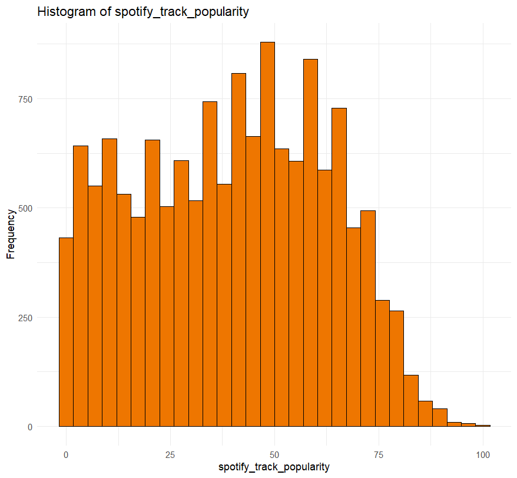
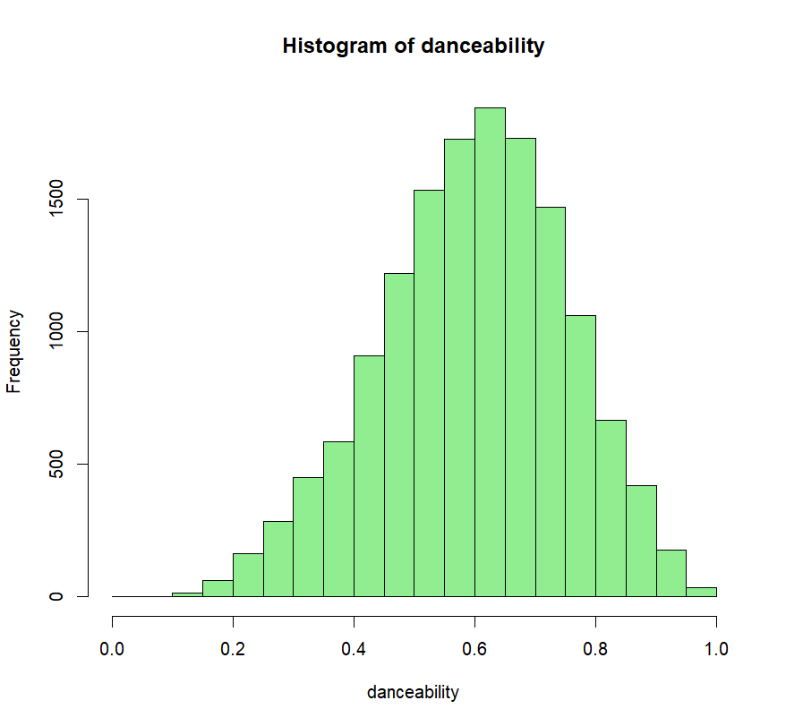
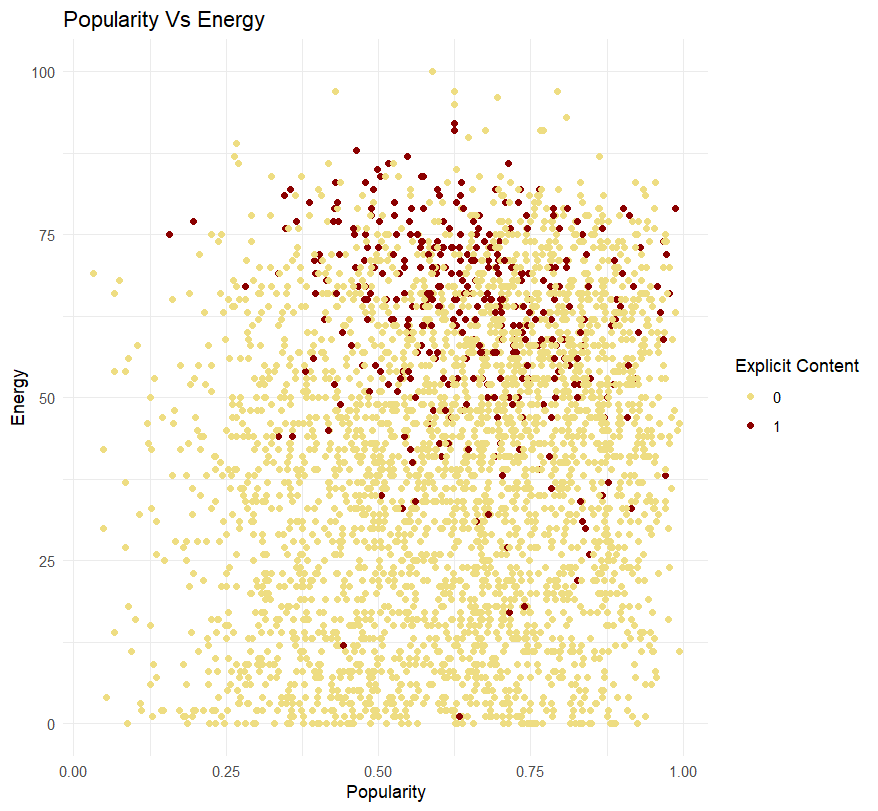
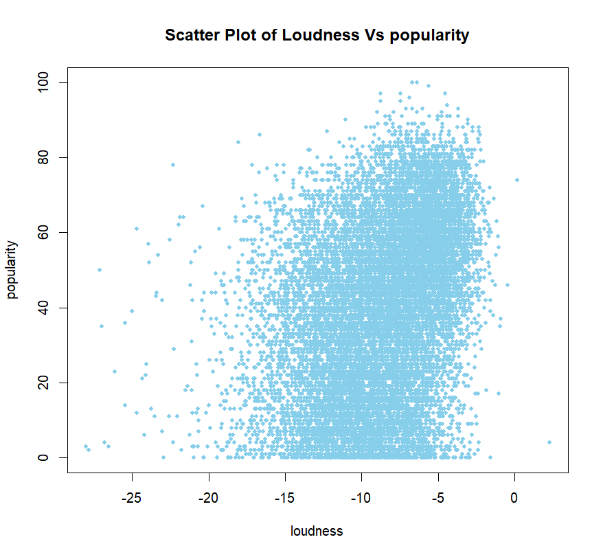
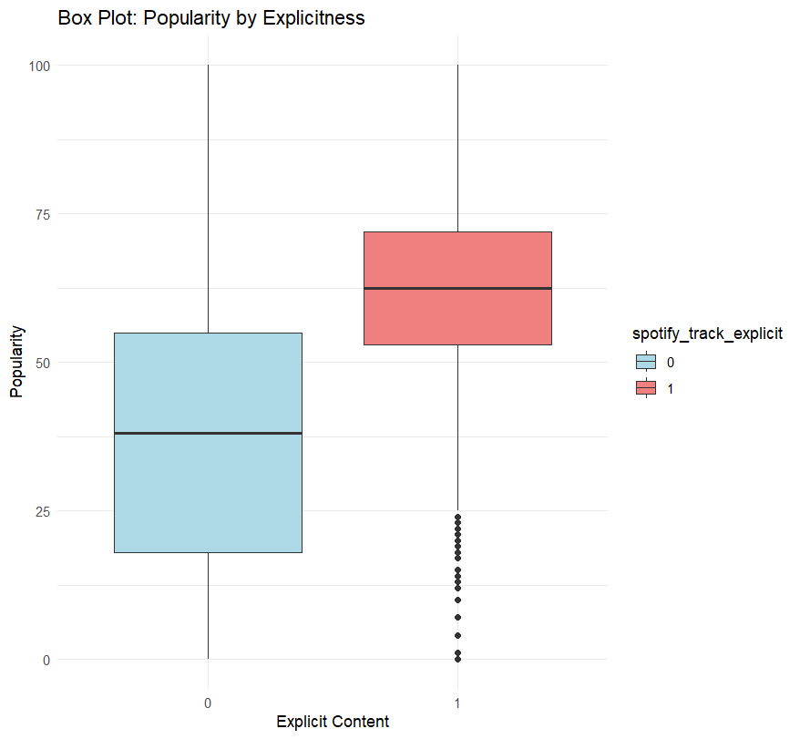
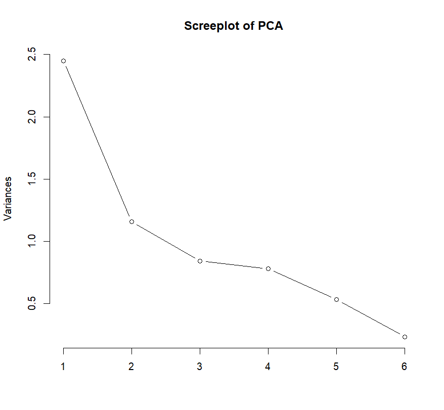
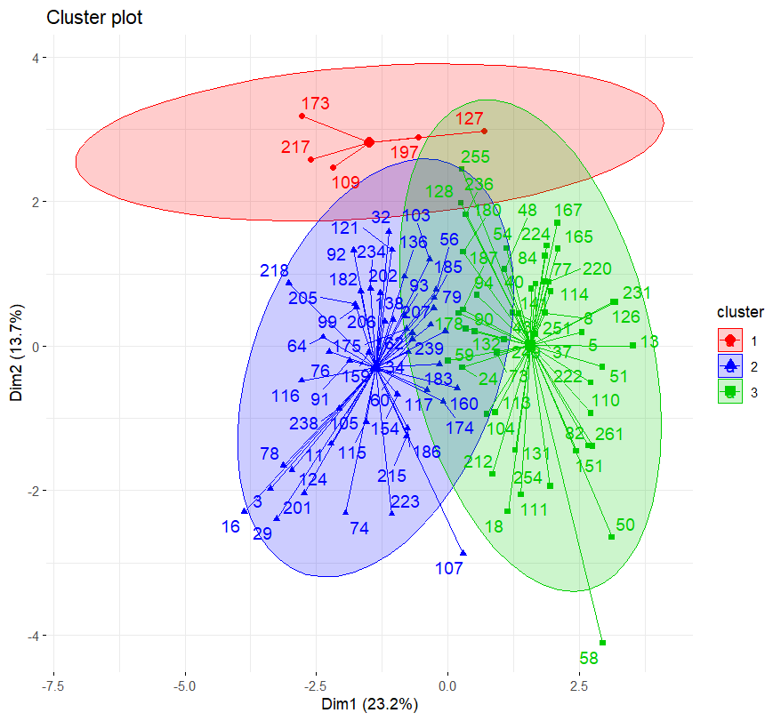
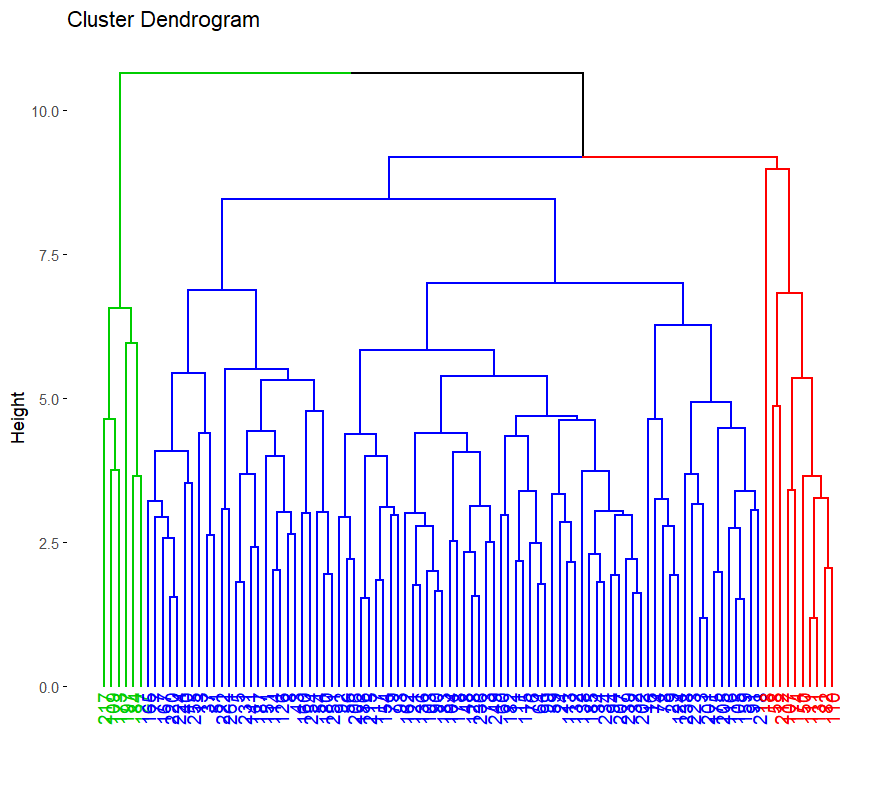

# 🎵 Spotify Song Popularity Analysis

<div align="center">

### Statistical Data Analysis & Visualization using R

Discover the factors influencing Spotify song popularity through statistical analysis, exploratory data analysis, regression modeling, principal component analysis, factor analysis, and clustering techniques.

<br>


</div>

---

# 📌 Project Overview

Spotify generates a large amount of audio feature data for every published song. This project investigates how different musical characteristics contribute to song popularity using statistical data analysis techniques.

The analysis includes data preprocessing, exploratory data analysis (EDA), correlation analysis, regression modeling, dimensionality reduction, factor analysis, and clustering to uncover meaningful patterns within Spotify songs.

The project demonstrates practical applications of statistics and data analytics using the R programming language.

---

# ✨ Project Features

- Data Cleaning & Preprocessing
- Exploratory Data Analysis (EDA)
- Correlation Analysis
- Multiple Linear Regression
- Principal Component Analysis (PCA)
- Factor Analysis
- K-Means Clustering
- Hierarchical Clustering
- Statistical Data Visualization

---

# 🛠 Tech Stack

| Technology | Purpose |
|------------|---------|
|  | R Programming |
|  | RStudio |
| ggplot2 | Data Visualization |
| corrplot | Correlation Matrix |
| psych | Factor Analysis |
| factoextra | Principal Component Analysis |
| cluster | Clustering |
| stats | Statistical Analysis |

---

# 📂 Dataset

The dataset contains Spotify audio features collected for multiple songs.

### Features Included

- Popularity
- Danceability
- Energy
- Loudness
- Speechiness
- Acousticness
- Instrumentalness
- Liveness
- Valence
- Tempo

Dataset Location

```
data/audio_features.csv
```

---

# 📊 Statistical Methods

The following statistical techniques were applied throughout the analysis:

### 📈 Exploratory Data Analysis (EDA)

Understanding the distribution and characteristics of Spotify audio features.

---

### 📉 Correlation Analysis

Examining relationships between different audio features using a correlation matrix.

---

### 📈 Multiple Linear Regression

Building regression models to identify which variables significantly influence song popularity.

---

### 📊 Principal Component Analysis (PCA)

Reducing dimensionality while preserving the maximum variance within the dataset.

---

### 🔍 Factor Analysis

Discovering hidden relationships among audio features.

---

### 🎯 K-Means Clustering

Grouping songs with similar characteristics.

---

### 🌳 Hierarchical Clustering

Visualizing similarity between songs using dendrograms.

---

# 📈 Project Results

## Correlation Matrix

<p align="center">

</p>

---

## Track Popularity Distribution

<p align="center">

</p>

---

## Danceability Distribution

<p align="center">

</p>

---

## Popularity vs Energy

<p align="center">

</p>

---

## Loudness vs Popularity

<p align="center">

</p>

---

## Box Plot

<p align="center">

</p>

---

## PCA Scree Plot

<p align="center">

</p>

---

## Cluster Plot

<p align="center">

</p>

---

## Cluster Dendrogram

<p align="center">

</p>

---

# 📁 Project Structure

```
spotify-song-popularity-analysis
│
├── data
│   └── audio_features.csv
│
├── images
│   ├── box-plot.png
│   ├── cluster-dendrogram.png
│   ├── cluster-plot.png
│   ├── correlation-matrix.png
│   ├── danceability-histogram.png
│   ├── popularity-histogram.png
│   ├── loudness-vs-popularity.png
│   ├── popularity-vs-energy.png
│   └── pca-screeplot.png
│
├── scripts
│   └── spotify_analysis.R
│
└── README.md
```

---

# 🚀 Getting Started

## Clone the repository

```bash
git clone https://github.com/KAVINADINIVEDYA/spotify-song-popularity-analysis.git
```

## Open the project

Open the project in **RStudio** or any R development environment.

---

## Install required packages

```R
install.packages(c(
  "ggplot2",
  "corrplot",
  "psych",
  "factoextra",
  "cluster"
))
```

---

## Run

Execute

```
scripts/spotify_analysis.R
```

---

# 📌 Key Insights

- Identified relationships between Spotify audio features and song popularity.
- Explored feature distributions through exploratory data analysis.
- Reduced feature dimensionality using PCA.
- Identified latent feature groups using Factor Analysis.
- Clustered songs based on similar audio characteristics.
- Applied regression analysis to evaluate predictors of popularity.

---

 

<div align="center">

⭐ If you found this project interesting, consider giving it a star!

</div>
